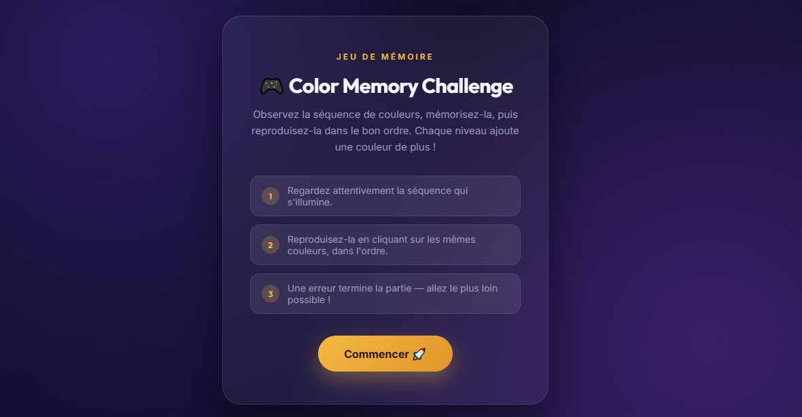
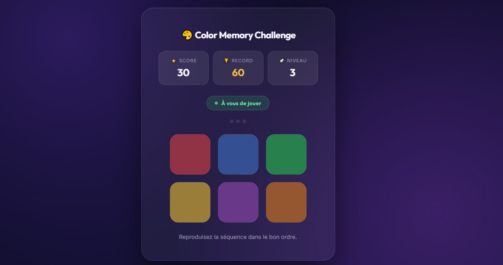
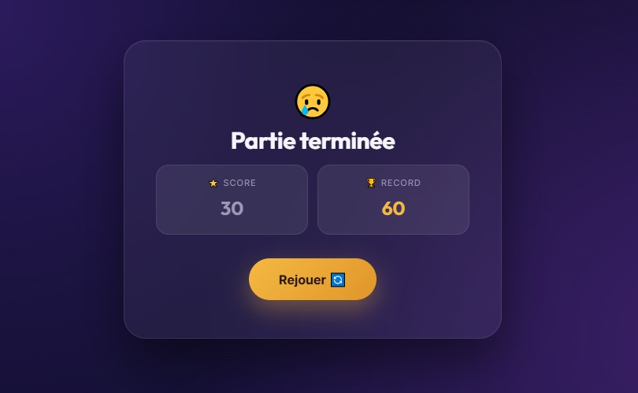
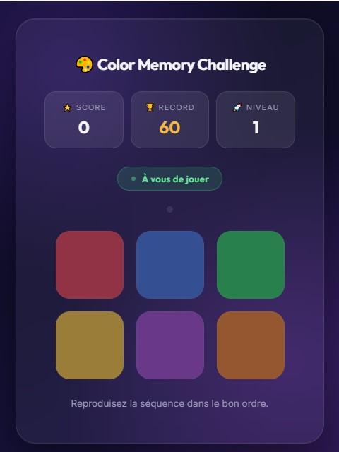

# 🎨 Color Memory Challenge

A modern and responsive memory game developed with **React** and **Vite**. The game challenges players to memorize and reproduce a sequence of colors while progressively increasing the difficulty.

## 🚀 Live Demo

https://color-memory-challenge.vercel.app

## ✨ Features

- 🎮 Interactive memory game
- 🧠 Memory training
- 📈 Score system
- 🏆 Best score saved with Local Storage
- 🚀 Progressive levels
- 📱 Responsive design
- 🎨 Modern user interface

## 🛠 Technologies

- React
- Vite
- JavaScript (ES6+)
- CSS3
- Vercel

## 📸 Screenshots

### 🏠 Home

### 🎮 Gameplay

### 😢 Game Over

### 📱 Mobile Version

## 👩‍💻 Author

**BELHADJ Hana**
